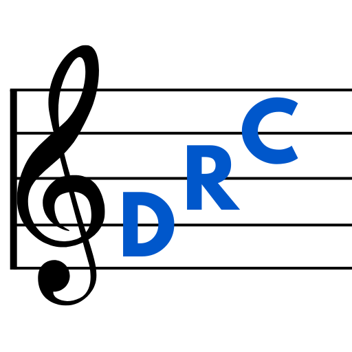

[![Contributors][contributors-shield]][contributors-url] [![Forks][forks-shield]][forks-url] [![Stargazers][stars-shield]][stars-url] [![Issues][issues-shield]][issues-url] [![GNU General Public License][license-shield]][license-url]

<div align="center">
  <a href="https://github.com/jwiggenhorn/drc-admin-panel">
    
  </a>
<h3 align="center">Digital Response Capture Admin Panel</h3>
  <p align="center">
    Website for creating and viewing DRC studies
    <br />
    <a href="https://drc-admin-panel.vercel.app/"><strong>Check it out »</strong></a>
    <br />
    <br />
    <a href="https://github.com/jwiggenhorn/drc-admin-panel/issues">Report Bug or Request Feature</a>
  </p>
</div>

## About The Project

The Digital Response Capture (DRC) project consists of a [mobile application](https://github.com/jwiggenhorn/drc-app) used for collecting real-time input data from a study participant, and this web application used to create the studies and view the collected participant data.

This project was developed by a group of four students at Southern Illinois University Edwardsville for the university's music department and was inspired by the Continuous Response Digital Interface, a hardware device historically used in music research.

The goal of this project is to give researchers a better way to measure and study certain responses to music in order to better understand how people feel, think about, and experience different aspects of music.

The DRC project is completely open-source and contributions towards its continued development and maintenance are welcome and encouraged.

### Built With

- [React](https://reactjs.org/)
- [Next.js](https://nextjs.org/)
- [NextAuth.js](https://next-auth.js.org/)
- [MongoDB](https://www.mongodb.com/)
- [Google Cloud](https://cloud.google.com/)
- [MUI](https://mui.com/)

## Getting Started

To get a local copy up and running follow these steps.

### Prerequisites

Install the following:

- [Node.js](https://nodejs.org/)
- [MongoDB Community Edition](https://www.mongodb.com/docs/manual/administration/install-community/)

### Running Locally

1. Clone the repo

   ```sh
   git clone https://github.com/jwiggenhorn/drc-admin-panel.git
   ```
2. Install NPM packages

   ```sh
   npm i
   ```
3. Create an .env.local file at the project root directory with the following environment variables:

- MONGODB_URI
- GOOGLE_CLIENT_ID
- GOOGLE_CLIENT_SECRET
- NEXTAUTH_SECRET
- NEXTAUTH_URL
- PROJECT_ID
- CLIENT_EMAIL
- PRIVATE_KEY
- BUCKET_NAME

These are documented in detail [here](https://github.com/jwiggenhorn/drc-admin-panel/wiki/Environment-Variables)

4. Build and run

   ```sh
   npm run dev
   ```

## Roadmap

See the [open issues](https://github.com/jwiggenhorn/drc-admin-panel/issues) for a full list of proposed features (and known issues).

## Contributing

If you have a suggestion that would make this better, please fork the repo and create a pull request. You can also simply open an issue with the tag "enhancement".

Don't forget to give the project a star! Thanks again!

1. Fork the Project
2. Create your Feature Branch (`git checkout -b feature/AmazingFeature`)
3. Commit your Changes (`git commit -m 'Add some AmazingFeature'`)
4. Push to the Branch (`git push origin feature/AmazingFeature`)
5. Open a Pull Request

## License

Distributed under the GNU General Public License. See `LICENSE.txt` for more information.

## Contact

Jonah Wiggenhorn - jonahwiggenhorn@gmail.com

<!-- MARKDOWN LINKS & IMAGES -->
<!-- https://www.markdownguide.org/basic-syntax/#reference-style-links -->

[contributors-shield]: https://img.shields.io/github/contributors/jwiggenhorn/drc-admin-panel.svg?style=for-the-badge
[contributors-url]: https://github.com/jwiggenhorn/drc-admin-panel/graphs/contributors
[forks-shield]: https://img.shields.io/github/forks/jwiggenhorn/drc-admin-panel.svg?style=for-the-badge
[forks-url]: https://github.com/jwiggenhorn/drc-admin-panel/network/members
[stars-shield]: https://img.shields.io/github/stars/jwiggenhorn/drc-admin-panel.svg?style=for-the-badge
[stars-url]: https://github.com/jwiggenhorn/drc-admin-panel/stargazers
[issues-shield]: https://img.shields.io/github/issues/jwiggenhorn/drc-admin-panel.svg?style=for-the-badge
[issues-url]: https://github.com/jwiggenhorn/drc-admin-panel/issues
[license-shield]: https://img.shields.io/github/license/jwiggenhorn/drc-admin-panel.svg?style=for-the-badge
[license-url]: https://github.com/jwiggenhorn/drc-admin-panel/blob/master/LICENSE.txt
